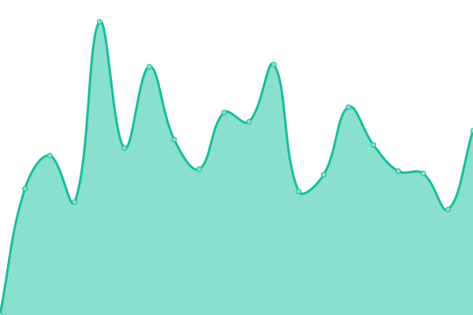
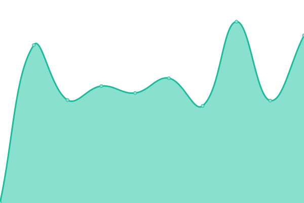
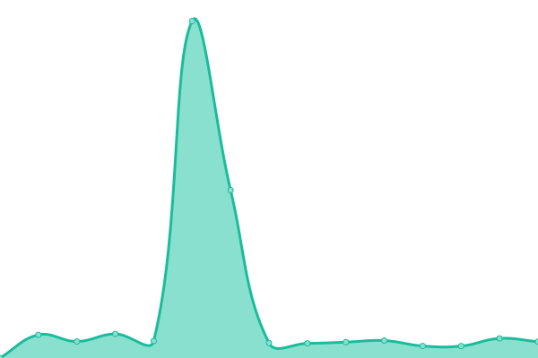
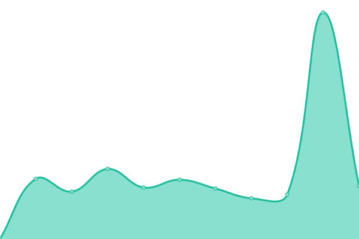
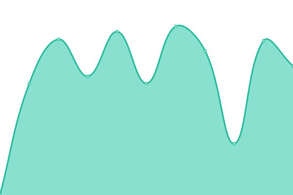

# [📈 Live Status](https://status.unistudents.gr): <!--live status--> **🟧 Partial outage**

This repository contains the open-source uptime monitor and status page for [Upptime](https://upptime.js.org), powered by [Upptime](https://github.com/upptime/upptime).

With [Upptime](https://upptime.js.org), you can get your own unlimited and free uptime monitor and status page, powered entirely by a GitHub repository. We use [Issues](https://github.com/upptime/upptime/issues) as incident reports, [Actions](https://github.com/donfn/unistudents-status/actions) as uptime monitors, and [Pages](https://status.unistudents.gr) for the status page.

<!--start: status pages-->
<!-- This summary is generated by Upptime (https://github.com/upptime/upptime) -->
<!-- Do not edit this manually, your changes will be overwritten -->
<!-- prettier-ignore -->
| URL | Status | History | Response Time | Uptime |
| --- | ------ | ------- | ------------- | ------ |
|  [Κεντρικό API (UniStudents)](https://api.unistudents.gr/) | 🟥 Down | [kentriko-api-uni-students.yml](https://github.com/donfn/unistudents-status/commits/HEAD/history/kentriko-api-uni-students.yml) | 

 766ms
     
 | 

<a href="https://status.unistudents.gr/history/kentriko-api-uni-students">0.00%</a>
    

|  [Scrape Farm - Node 1 (UniStudents)](https://scrape-farm-1.unistudents.gr/) | 🟥 Down | [scrape-farm-node-1-uni-students.yml](https://github.com/donfn/unistudents-status/commits/HEAD/history/scrape-farm-node-1-uni-students.yml) | 

 649ms
     
 | 

<a href="https://status.unistudents.gr/history/scrape-farm-node-1-uni-students">99.99%</a>
    

|  [Scrape Farm - Node 2 (UniStudents)](https://scrape-farm-2.unistudents.gr/) | 🟥 Down | [scrape-farm-node-2-uni-students.yml](https://github.com/donfn/unistudents-status/commits/HEAD/history/scrape-farm-node-2-uni-students.yml) | 

 639ms
     
 | 

<a href="https://status.unistudents.gr/history/scrape-farm-node-2-uni-students">99.99%</a>
    

|  [Scrape Farm - Node 3 (UniStudents)](https://scrape-farm-3.unistudents.gr/) | 🟩 Up | [scrape-farm-node-3-uni-students.yml](https://github.com/donfn/unistudents-status/commits/HEAD/history/scrape-farm-node-3-uni-students.yml) | 

 723ms
     
 | 

<a href="https://status.unistudents.gr/history/scrape-farm-node-3-uni-students">100.00%</a>
    

|  [Scrape Farm - Node 4 (UniStudents)](https://scrape-farm-4.unistudents.gr/) | 🟩 Up | [scrape-farm-node-4-uni-students.yml](https://github.com/donfn/unistudents-status/commits/HEAD/history/scrape-farm-node-4-uni-students.yml) | 

 815ms
     
 | 

<a href="https://status.unistudents.gr/history/scrape-farm-node-4-uni-students">100.00%</a>
    

|  [Α.Σ.ΠΑΙ.Τ.Ε](https://studentweb.aspete.gr/) | 🟩 Up | [a-s-pai-t-e.yml](https://github.com/donfn/unistudents-status/commits/HEAD/history/a-s-pai-t-e.yml) | 

 1704ms
     
 | 

<a href="https://status.unistudents.gr/history/a-s-pai-t-e">100.00%</a>
    

|  [Αριστοτέλειο Πανεπιστήμιο](https://universis-api.it.auth.gr/api) | 🟩 Up | [aristoteleio-panepistimio.yml](https://github.com/donfn/unistudents-status/commits/HEAD/history/aristoteleio-panepistimio.yml) | 

 1724ms
     
 | 

<a href="https://status.unistudents.gr/history/aristoteleio-panepistimio">100.00%</a>
    

|  [Γεωπονικό Πανεπιστήμιο Αθηνών](https://unistudent.aua.gr/) | 🟩 Up | [geoponiko-panepistimio-athinon.yml](https://github.com/donfn/unistudents-status/commits/HEAD/history/geoponiko-panepistimio-athinon.yml) | 

 2586ms
     
 | 

<a href="https://status.unistudents.gr/history/geoponiko-panepistimio-athinon">100.00%</a>
    

|  [Δημοκρίτειο Πανεπιστήμιο Θράκης](https://oauth.duth.gr/login) | 🟥 Down | [dimokriteio-panepistimio-t-hrakis.yml](https://github.com/donfn/unistudents-status/commits/HEAD/history/dimokriteio-panepistimio-t-hrakis.yml) | 

 0ms
     
 | 

<a href="https://status.unistudents.gr/history/dimokriteio-panepistimio-t-hrakis">0.00%</a>
    

|  [Διεθνές Πανεπιστήμιο Ελλάδος (UNIPORTAL)](https://uniportal.ihu.gr/) | 🟩 Up | [diethnes-panepistimio-ellados-uniportal.yml](https://github.com/donfn/unistudents-status/commits/HEAD/history/diethnes-panepistimio-ellados-uniportal.yml) | 

 1581ms
     
 | 

<a href="https://status.unistudents.gr/history/diethnes-panepistimio-ellados-uniportal">73.78%</a>
    

|  [Εθνικό Μετσόβιο Πολυτεχνείο](https://backend.central.ntua.gr/) | 🟩 Up | [ethniko-metsovio-polytexneio.yml](https://github.com/donfn/unistudents-status/commits/HEAD/history/ethniko-metsovio-polytexneio.yml) | 

 1583ms
     
 | 

<a href="https://status.unistudents.gr/history/ethniko-metsovio-polytexneio">100.00%</a>
    

|  [Εθνικό Μετσόβιο Πολυτεχνείο (ΣΥΜΜΗ)](https://students.ece.ntua.gr/login) | 🟩 Up | [ethniko-metsovio-polytexneio-symmi.yml](https://github.com/donfn/unistudents-status/commits/HEAD/history/ethniko-metsovio-polytexneio-symmi.yml) | 

 1240ms
     
 | 

<a href="https://status.unistudents.gr/history/ethniko-metsovio-polytexneio-symmi">100.00%</a>
    

|  [Εθνικό Καποδιστριακό Πανεπιστήμιο](https://my-studies.uoa.gr/Secr3w/connect.aspx) | 🟩 Up | [ethniko-kapodistriako-panepistimio.yml](https://github.com/donfn/unistudents-status/commits/HEAD/history/ethniko-kapodistriako-panepistimio.yml) | 

 999ms
     
 | 

<a href="https://status.unistudents.gr/history/ethniko-kapodistriako-panepistimio">100.00%</a>
    

|  [Ελληνικό Μεσογειακό Πανεπιστήμιο](https://universis-api.hmu.gr/api/) | 🟩 Up | [elliniko-mesogeiako-panepistimio.yml](https://github.com/donfn/unistudents-status/commits/HEAD/history/elliniko-mesogeiako-panepistimio.yml) | 

 1453ms
     
 | 

<a href="https://status.unistudents.gr/history/elliniko-mesogeiako-panepistimio">100.00%</a>
    

|  [Ιόνιο Πανεπιστήμιο](https://dias.ionio.gr/) | 🟩 Up | [ionio-panepistimio.yml](https://github.com/donfn/unistudents-status/commits/HEAD/history/ionio-panepistimio.yml) | 

 2170ms
     
 | 

<a href="https://status.unistudents.gr/history/ionio-panepistimio">100.00%</a>
    

|  [Οικονομικό Πανεπιστήμιο Αθηνών](https://e-grammateia.aueb.gr/unistudent/) | 🟩 Up | [oikonomiko-panepistimio-athinon.yml](https://github.com/donfn/unistudents-status/commits/HEAD/history/oikonomiko-panepistimio-athinon.yml) | 

 1461ms
     
 | 

<a href="https://status.unistudents.gr/history/oikonomiko-panepistimio-athinon">85.19%</a>
    

|  [Πανεπιστήμιο Αιγαίου (UNIVERSIS)](https://uni-extapi.aegean.gr/api/) | 🟩 Up | [panepistimio-aigaioy-universis.yml](https://github.com/donfn/unistudents-status/commits/HEAD/history/panepistimio-aigaioy-universis.yml) | 

 1601ms
     
 | 

<a href="https://status.unistudents.gr/history/panepistimio-aigaioy-universis">99.76%</a>
    

|  [Πανεπιστήμιο Δυτικής Αττικής](https://services.uniwa.gr/) | 🟩 Up | [panepistimio-dytikis-attikis.yml](https://github.com/donfn/unistudents-status/commits/HEAD/history/panepistimio-dytikis-attikis.yml) | 

 1947ms
     
 | 

<a href="https://status.unistudents.gr/history/panepistimio-dytikis-attikis">100.00%</a>
    

|  [Πανεπιστήμιο Δυτικής Μακεδονίας](https://students.uowm.gr/) | 🟩 Up | [panepistimio-dytikis-makedonias.yml](https://github.com/donfn/unistudents-status/commits/HEAD/history/panepistimio-dytikis-makedonias.yml) | 

 4102ms
     
 | 

<a href="https://status.unistudents.gr/history/panepistimio-dytikis-makedonias">99.94%</a>
    

|  [Πανεπιστήμιο Ιωαννίνων](https://classweb.uoi.gr/) | 🟩 Up | [panepistimio-ioanninon.yml](https://github.com/donfn/unistudents-status/commits/HEAD/history/panepistimio-ioanninon.yml) | 

 1876ms
     
 | 

<a href="https://status.unistudents.gr/history/panepistimio-ioanninon">100.00%</a>
    

|  [Πανεπιστήμιο Κρήτης](https://student.cc.uoc.gr/) | 🟩 Up | [panepistimio-kritis.yml](https://github.com/donfn/unistudents-status/commits/HEAD/history/panepistimio-kritis.yml) | 

 3558ms
     
 | 

<a href="https://status.unistudents.gr/history/panepistimio-kritis">100.00%</a>
    

|  [Πανεπιστήμιο Πατρών](https://progress.upatras.gr) | 🟩 Up | [panepistimio-patron.yml](https://github.com/donfn/unistudents-status/commits/HEAD/history/panepistimio-patron.yml) | 

 2155ms
     
 | 

<a href="https://status.unistudents.gr/history/panepistimio-patron">100.00%</a>
    

|  [Πανεπιστήμιο Πειραιώς](https://sis-portal.unipi.gr) | 🟩 Up | [panepistimio-peiraios.yml](https://github.com/donfn/unistudents-status/commits/HEAD/history/panepistimio-peiraios.yml) | 

 2188ms
     
 | 

<a href="https://status.unistudents.gr/history/panepistimio-peiraios">100.00%</a>
    

|  [Πανεπιστήμιο Πελοποννήσου (Cardisoft)](https://e-secretary.uop.gr/UniStudent/) | 🟩 Up | [panepistimio-peloponnisoy-cardisoft.yml](https://github.com/donfn/unistudents-status/commits/HEAD/history/panepistimio-peloponnisoy-cardisoft.yml) | 

 1163ms
     
 | 

<a href="https://status.unistudents.gr/history/panepistimio-peloponnisoy-cardisoft">99.94%</a>
    

|  [Πάντειο Πανεπιστήμιο](https://foit.panteion.gr/declare/Login.aspx) | 🟩 Up | [panteio-panepistimio.yml](https://github.com/donfn/unistudents-status/commits/HEAD/history/panteio-panepistimio.yml) | 

 2475ms
     
 | 

<a href="https://status.unistudents.gr/history/panteio-panepistimio">96.58%</a>
    

|  [Πολυτεχνείο Κρήτης](https://universis-api.tuc.gr/api) | 🟩 Up | [polytexneio-kritis.yml](https://github.com/donfn/unistudents-status/commits/HEAD/history/polytexneio-kritis.yml) | 

 1157ms
     
 | 

<a href="https://status.unistudents.gr/history/polytexneio-kritis">99.53%</a>
    

|  [Πρώην ΤΕΙ Δυτικής Ελλάδας (TCP Ping)](195.251.8.50) | 🟩 Up | [proin-tei-dytikis-elladas-tcp-ping.yml](https://github.com/donfn/unistudents-status/commits/HEAD/history/proin-tei-dytikis-elladas-tcp-ping.yml) | 

 172ms
     
 | 

<a href="https://status.unistudents.gr/history/proin-tei-dytikis-elladas-tcp-ping">100.00%</a>
    

|  [Χαροκόπειο Πανεπιστήμιο Αθηνών](https://e-studies.hua.gr/unistudent/) | 🟩 Up | [xarokopeio-panepistimio-athinon.yml](https://github.com/donfn/unistudents-status/commits/HEAD/history/xarokopeio-panepistimio-athinon.yml) | 

 2488ms
     
 | 

<a href="https://status.unistudents.gr/history/xarokopeio-panepistimio-athinon">100.00%</a>
    

<!--end: status pages-->

[**Visit our status website →**](https://status.unistudents.gr)

## 📄 License

- Powered by: [Upptime](https://github.com/upptime/upptime)
- Code: [MIT](./LICENSE) © [Upptime](https://upptime.js.org)
- Data in the `./history` directory: [Open Database License](https://opendatacommons.org/licenses/odbl/1-0/)
